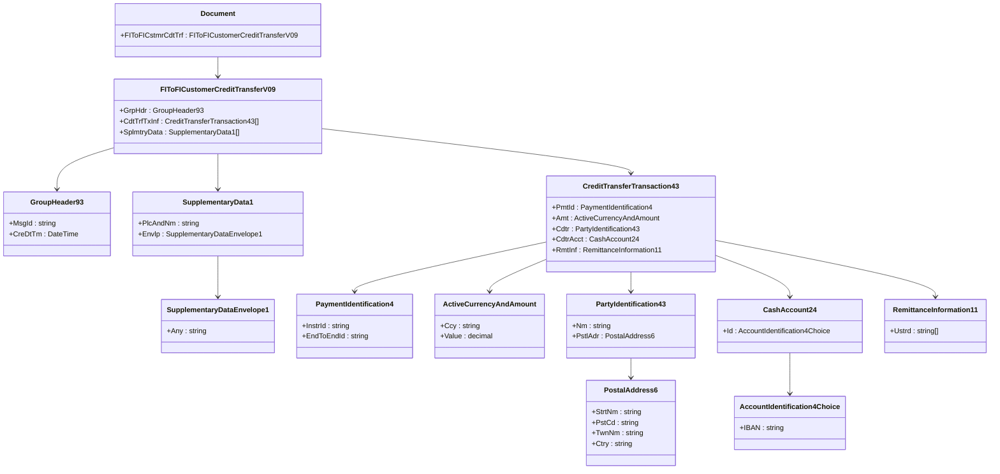

# Documentação do Projeto ISO 20022

## Visão Geral
Este projeto implementa estruturas de mensagens financeiras baseadas no padrão **ISO 20022**. Essas mensagens são amplamente utilizadas para comunicação padronizada no setor financeiro, incluindo pagamentos, transferências de crédito, débito e transações de compensação.

---

## Sobre o ISO 20022
O **ISO 20022** é um padrão internacional para mensagens eletrônicas entre instituições financeiras. Ele fornece uma linguagem comum e formatos estruturados baseados em XML, usados globalmente.

### Benefícios:
- **Padronização Global**: Compatível em diversos mercados.
- **Extensibilidade**: Suporta adições e personalizações específicas.
- **Interoperabilidade**: Integração simplificada entre sistemas e redes.

### Tipos de Mensagens:
1. **PACS** - Pagamentos e Transferências (Payment Clearing and Settlement).
2. **PAIN** - Iniciação de Pagamentos (Payments Initiation).
3. **CAMT** - Gestão de Contas e Relatórios (Cash Management).
4. **SEMT** - Transferências de Títulos e Relatórios (Securities Management).

Cada tipo possui várias versões e variantes específicas para diferentes cenários e funcionalidades.

---

## Estrutura do Projeto

### Pastas e Arquivos:
- **PACS.Message/** - Contém as classes C# auto-geradas baseadas nos XSD.
- **XSD/** - Contém os esquemas XSD usados para gerar as classes.
- **mermaid_pacs_008.md** - Diagrama UML no formato Mermaid para visualização gráfica.

### Mensagens Suportadas:
- **pacs.008** - Transferência de Crédito (Credit Transfer)
- **pacs.002** - Relatório de Status de Pagamento (Payment Status Report)
- **pacs.004** - Devolução de Transferência (Payment Return)

---

## Exemplo - pacs.008 (Transferência de Crédito)
### Código para Geração de XML
```csharp
using System;
using System.IO;
using System.Xml.Serialization;

var document = new Document
{
    FIToFICstmrCdtTrf = new FIToFICustomerCreditTransferV09
    {
        GrpHdr = new GroupHeader93
        {
            MsgId = "12345",
            CreDtTm = DateTime.UtcNow
        },
        CdtTrfTxInf = new[]
        {
            new CreditTransferTransaction43
            {
                PmtId = new PaymentIdentification4 { InstrId = "Instr123", EndToEndId = "End123" },
                Amt = new ActiveCurrencyAndAmount { Ccy = "USD", Value = 1000.00m }
            }
        }
    }
};

var serializer = new XmlSerializer(typeof(Document));
using (var writer = new StreamWriter("pacs_008_output.xml"))
{
    serializer.Serialize(writer, document);
}
```

### Diagrama UML (Mermaid)


---

## Ferramentas Recomendadas
- **Visual Studio** - Para edição e depuração.
- **PlantUML** - Para visualizar e editar diagramas UML.
- **Mermaid Live Editor** - [https://mermaid.live](https://mermaid.live) para visualização de diagramas.

---

## Observações
- As classes foram geradas automaticamente e devem ser atualizadas conforme novas versões do XSD.
- As estruturas seguem o padrão ISO 20022, garantindo compatibilidade com sistemas financeiros.

---

## Contato
Caso tenha dúvidas ou precise de suporte, entre em contato com devcomputariahub@exemplo.com.

